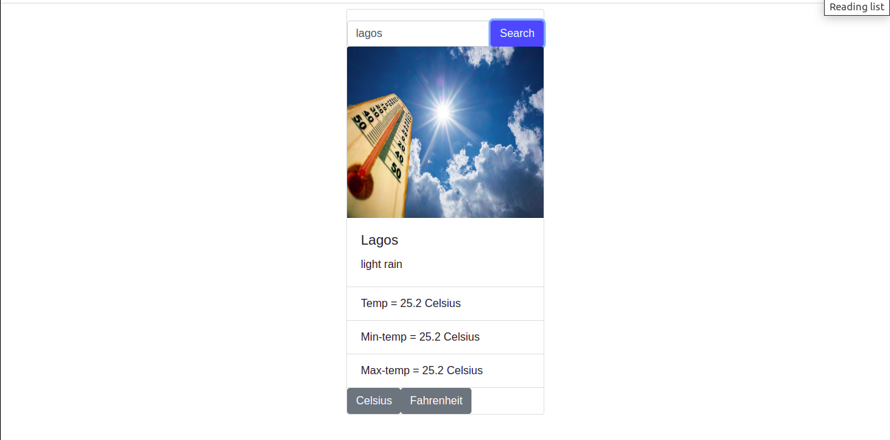

# WeatherApp

In this project, I built a basic weather application using JavaScript, Webpack and API. weather app that pulls from the OpenWeatherMap API to allow users to search for and view the forecast in cities worldwide.



## Built With

- JavaScript
- Webpack
- API
- Html
- Bootstrap

### System requirements

- Web Browser

## Install WebPack

```
$ npm install --save-dev webpack
```

## Getting Started

To get a local copy of the repository please run the following commands on your terminal:

```
$ cd <folder>
```

```
$ git clone git@github.com:verissimohenry/WeatherApp.git
```

```
$ cd WeatherApp
```

```
$ npm install
```

## Instructions

> Visit https://openweathermap.org/

> Create a free account!

> Copy the API-key which you can find in your email or account.

> Change the API in src/index.js on line 1.

> To use the app simply enter the name of your city and click on search.

## Author

👤 **Verissimo Henry**

- Github: [@githubhandle](https://github.com/verissimohenry)
- Twitter: [@twitterhandle](https://twitter.com/verissimohenry)
- Linkedin: [linkedin](https://www.linkedin.com/in/henry-verissimo-618906167/)
- Email: verissimohenry04@gmail.com

## 🤝 Contributing

Contributions, issues, and feature requests are welcome!

## Show your support

Give a ⭐️ if you like this project!

## Acknowledgments

- [Odin Projects](https://www.theodinproject.com/courses/)
- [Microverse](https://microverse.com)

## 📝 License

This project is [MIT](https://mit-license.org/) licensed.
